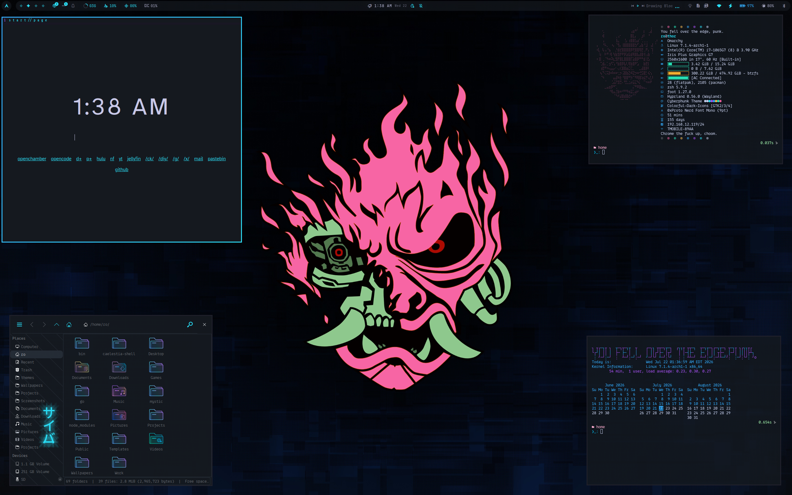

░█▀▀░█░█░█▀▄░█▀▀░█▀▄░█▀█░█░█░█░█░█▀█░█░█
░█░░░░█░░█▀▄░█▀▀░█▀▄░█▀▀░█▀█░█░█░█░█░█▀▄
░▀▀▀░░▀░░▀▀░░▀▀▀░▀░▀░▀░░░▀░▀░▀▀▀░▀░▀░▀░▀

---

An Omarchy Theme for your Arch Linux / Hyprland setup based on Cyberpunk aesthetics and neon colors.

## Installation

To install this theme, simply use the ``omarchy-theme-install``   

command: `` omarchy-theme-install https://github.com/signaldirective/cyberphunk ``  

  

**Theme by [Signal Directive](https://ko-fi.com/signaldirective)**  

**Additional Credits:** HANCORE for quickshell theme
